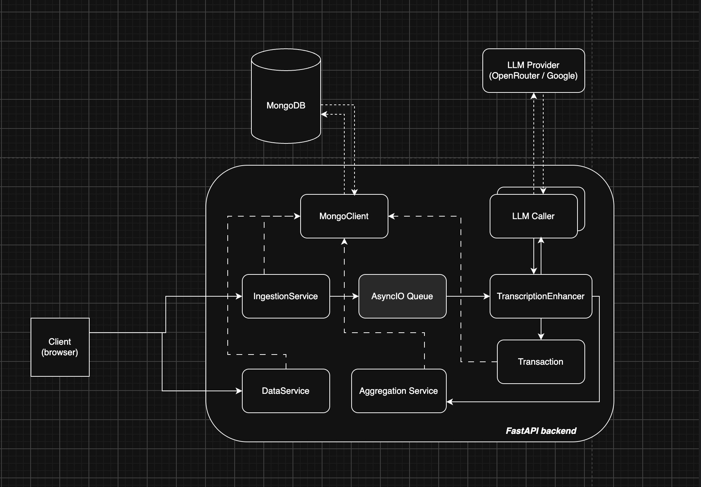

# Prueba Técnica Vambe - Domingo Venegas

Aplicación FastAPI + MongoDB que ingiere transcripciones de reuniones con
clientes desde un CSV, las enriquece con un LLM y expone un dashboard de
insights sobre los resultados.

## Localmente

Requisitos: Docker y un string de conexión a MongoDB.

```bash
cp .env.example .env     # luego completar MONGO_URI y una API key de LLM
docker compose up --build
```

Abrir **http://localhost:8080**.

Dos contenedores: `web` (nginx) sirve la SPA compilada y hace proxy de `/api`
hacia `backend` (FastAPI + uvicorn), que no se publica. Al ser mismo origen, las
URLs relativas `/api/*` del frontend funcionan sin configurar CORS.

### La funcionalidad de LLM necesita una API key

⚠️ **Sin API key el enriquecimiento no funciona.** Hay que definir en `.env`
`LLM_PROVIDER` (`openrouter` por defecto, o `google`) y la key correspondiente:
`OPENROUTER_API_KEY` o `GOOGLE_API_KEY`. Sin ella, la subida del CSV se acepta
pero el job de enriquecimiento falla y no se persiste nada — ni clientes, ni
reuniones, ni clasificaciones.

El resto de la app sí funciona sin key: el dashboard lee un blob de insights ya
calculado en Mongo, así que si la base ya tiene datos enriquecidos se ve
completo.

## Deployment: 

La app esta live en [render](https://vambe-insights.onrender.com/#/dashboard). 

## Supuestos:
Para el desarrollo del proyecto se hicieron los siguientes supuestos:

1. Una reunión es identificada por `Nombre, Phone, Email, Fecha`. No existen reuniones distintas con esa misma llave.
2. Gemma 4 es suficiente para la categorización de transcripciones. Un modelo mejor tal vez haría un mejor trabajo, pero estamos "bounded" por modelos gratuitos. 

## Arquitectura



El backend es un monolito FastAPI con subpaquetes de una sola responsabilidad
(`ingestion`, `llm`, `aggregation`, `db`, `api`) que se componen mediante
llamadas de función. Las cuatro decisiones que definen la forma del sistema:

### 1. La subida del CSV no persiste nada, y tiene un tope de N transcripciones

`POST /api/ingestion/csv` parsea y valida el archivo completo en memoria (una
fila mala → 422) y encola las filas. **No escribe en la base de datos.** Toda la
persistencia ocurre dentro del worker, después de que el LLM haya clasificado.

Antes de llamar al modelo, el job en `app/llm/jobs.py`:

1. colapsa filas que comparten `enrichment_key` — el hash de
   `(nombre, email, teléfono, fecha)`, que *es* el `_id` de `EnhancedTranscript`;
2. descarta las keys que ya están en `enhanced_transcripts` (un solo `$in`
   proyectado);
3. **aplica el tope `max_transcripts`** (`LLM_MAX_TRANSCRIPTS_PER_JOB`, 100 por
   defecto, override por query param).

El tope existe porque la restricción real del tier gratuito es el **número de
requests**, no los tokens: las transcripciones promedian ~130 tokens, pero cada
batch es una request y el rate limit se agota mucho antes que el contexto. El
tope acota el costo y la duración de un job a algo predecible en vez de dejar
que un CSV de 10k filas defina el tiempo de ejecución.

Consecuencia útil del orden (dedup → tope → LLM): **volver a subir el mismo CSV
reanuda el trabajo**. El paso 2 salta todo lo que ya aterrizó, así que subir el
archivo tres veces con tope 100 procesa 300 transcripciones distintas.

### 2. Cola asíncrona para que la I/O del LLM no bloquee las requests

La app se probó usando `gemma-4-31b-it` a través de Google AI Studio. El modelo resultó muy lento en procesar varias transcripciones en un prompt, por lo que se hacen "batches" de 10, y se encolan para que se procesen de manera **asíncrona**:

El ingestion service encola las filas en un `asyncio.Queue` y
devuelve `201` con un `enrichment_job_id`. Un worker consume la
cola en background; el frontend consulta `GET /api/jobs` para ver el progreso.

Las llamadas a la API de Google AI Studio son lentas, y se configuró un `LLM_REQUEST_TIMEOUT_SECONDS=300` para detener una llamada muy lenta. 

### 3. Transacción a la base de datos

Por cada batch, para las transcripciones que el modelo efectivamente devolvió,
se escriben `Client` (get-or-create), `MeetingTranscript` y
`EnhancedTranscript` juntos en **una sola transacción de MongoDB**
(`_persist_classified`): aterrizan los tres o ninguno.

### 4. Datos pre-calculados:

`GET /api/dashboard/insights` devuelve **todos los datasets de gráficos para el dashboard en un solo payload cacheado** (`DashboardInsights`, `_id="latest"`). Se recalcula al final de cada job de procesamiento y, manualmente, vía `POST /api/dashboard/insights/recompute`. 

Como el dash no incluye filtros dinámicos y los CSV uploads son poco frecuentes, esto evita re-calcular la misma data en cada request y el dashboard nunca espera por un cálculo. 

## Dimensiones de las transcripciones

El LLM lee cada transcripción y asigna **10 dimensiones** (prompt en
`app/llm/prompts/system.md`, esquema en `app/models/enhanced_transcript.py`). Estas buscan dar insights al performance de los vendedores, y la tasa de conversión. La pregunta principal del dashboard es: **¿qué tipo de negocios son más propensos a convertir con Vambe?**


| # | Dimensión | Tipo | Qué aporta en el dashboard |
|---|-----------|------|----------------------------|
| 1 | **`sector`** — 15 industrias (retail_ecommerce, health_medical, food_beverage, education, …) | single select | Qué industrias cierran y cuáles no. Es también el eje de la matriz sector × necesidades y del desglose de vendedores por sector. |
| 2 | **`sub_sector`** — texto libre | free text | Contexto cualitativo debajo del bucket ("clínica dental", "distribuidora de repuestos"). |
| 3 | **`business_model`** — b2c / b2b / b2b2c / nonprofit_donor_facing | single select | Busca identificar el tipo de negocio del cliente, y si un modelo en particular cierra más que otro. |
| 4 | **`business_size`** — solo_micro / small / medium / large | single select | Proxy de tamaño del negocio del cliente. Cruzado con necesidades (heatmap tamaño × necesidad) muestra qué pide una empresa grande que una chica no. |
| 5 | **`inquiry_volume`** — low / medium / high / very_high (normalizado a consultas semanales) | single select | El indicador de dolor más objetivo del set. La normalización a base semanal la hace el modelo ("800/día → ~5600/semana"), así que volúmenes descritos en unidades distintas quedan comparables. |
| 6 | **`discovery_channel`** — linkedin, google_search_ads, peer_referral, evento, webinar, podcast, … | single select | Logra identificar cómo los clientes descubren Vambe, y si algúno de estos canales tiene mayor tasa de conversión. |
| 7 | **`current_channels`** — whatsapp, phone_calls, email, instagram, web_chat, delivery_apps, … | multi select | Los canales de comunicación que usa el cliente con sus usuarios. Útil para determinar qué canales tienen mejor adopción de Vambe. |
| 8 | **`client_needs`** — 15 necesidades (multi_channel_support, appointment_scheduling, integración CRM/ERP, 24/7, escalamiento a humano, …) | multi select | Necesidades/dolores del cliente. Sirve para identificar los problemaas más frecuentes, y las oportunidades de negocio para Vambe.  |
| 9 | **`regulatory_flag`** — health_data / financial_fiscal_data / minors_student_data / none_apparent | single select | Marca si el cliente requiere un manejo especial de los datos. Puede influír en la tasa de conversión. |
| 10 | **`pain_point_urgency`** — high / medium / low | single select | Busca un "análisis de sentimiento", para determinar si la urgencia del cliente incide en la tasa de conversión. |

## Layout

```
app/                 backend FastAPI — ver app/CLAUDE.md
frontend/            SPA Vite (vanilla JS) — ver frontend/CLAUDE.md
deploy/nginx.conf    serving estático + proxy /api para el setup de compose
scripts/             scripts de mantenimiento puntuales
aggregations.md      contrato del payload de insights del dashboard
```
